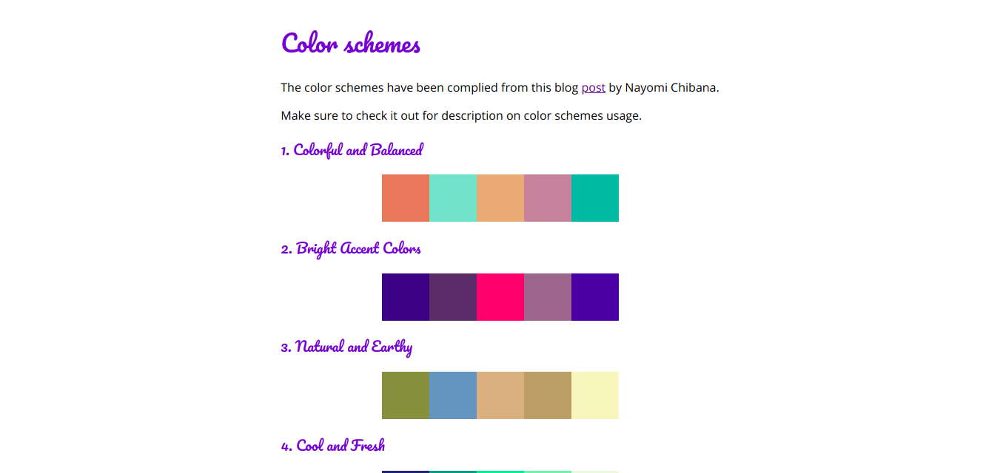

# rainbow
50 color schemes you choose from for your next design project.

  <b>Hosted at:</b> https://chegebryan.github.io/rainbow/

## Getting Started
To get the collection on your local clone this repo at `https://github.com/ChegeBryan/rainbow.git`.
 - Navigate to the project folder and open the file `index.html` with your favourite browser.
 - Choose the color combination you want to use and copy the color code using your color picker

## Acknowledgments
Colors have been adopted from this blog [post](https://visme.co/blog/website-color-schemes/). Hat tip to the blog author Nayomi Chibaba.
